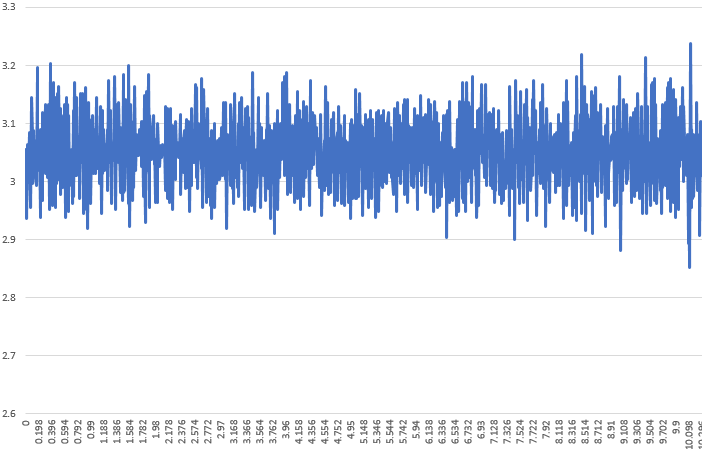
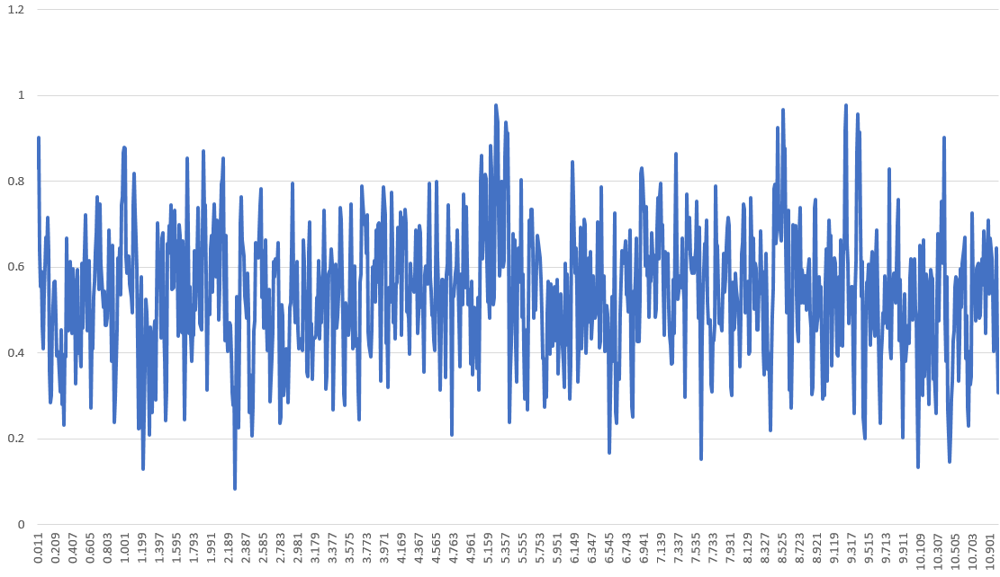
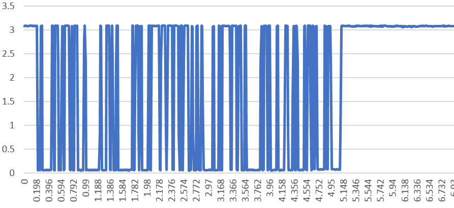

# Failed attempt at making RS232 work in place of SRR
Tried to use my [MAX3232 RS232 Serial Port To TTL Converter Module Male DB9 COM ME](https://www.ebay.com/itm/RS232-Serial-Port-To-TTL-Converter-Module-MAX3232-DB9-Connector-With-Cable-MO-/152193124831) as serial input to the teensy instead of the SRR module. Did not work. Teensy reads only gibberish on the serial input, regardless of whether a punch is made or not. 

Setup:
RS232 Sportident station connected to my "MAX3232 RS232 Serial Port To TTL Converter Module Male DB9 COM ME". 
Connected the converter module TXD pin to pin 0 (UART RX1) of the Teensy. It only read random gibberrish, at bursts. 
I used 4800 baud on both the Sportident station and the Teensy serial port.

To analyze what was actually sent, I wrote a small "logic analyzer" to run on the Teensy. See code below.
On my Teensy, each measurement lasted 11 ms with a resolution of 0.011 ms, which should be ok since on bit at 4800 baud is 0.21 ms. 
I pasted the serial monitor output into an excel sheet and drew a diagram of it. The captured measurement showed random noise between 0.2 and 0.9V, which is what I got with no input attached at all.
I tried to connect to the RXD pin of the converter module instead (just to check) and it read 3,3V constantly. I also tried modifying the logic analyzer script to trigger on low bit (less than 800 analogread), with the same results, i.e. it never triggered when punching.
Bottom line: i could not get anything that resembled real UART TTL bits out of my converter module. So I will throw those in the bin. Bought them on ebay...

Links: 
- [RS232 and UART overview](https://www.sparkfun.com/tutorials/215)
- [Max3232 datasheet](http://www.ti.com/lit/ds/symlink/max3232.pdf)
- [Teensy serial UART overview](https://www.pjrc.com/teensy/td_uart.html)
- [Using timers with elapsedMillis](https://www.pjrc.com/teensy/td_timing_elaspedMillis.html)

RXD pin: 
	 

TXD pin: 


As it should be, a punch from SRR module: 



```
int led = 13;
int a = 0; //which analog port
int x = 1000; //the analog measured value
const int n = 1000; //number of samples in each measurement
int xs[n]; //array to put the measurements in
elapsedMillis t=0;
void setup() {
  // put your setup code here, to run once:
  Serial.begin(9600);
  pinMode(led, OUTPUT);
  digitalWrite(led,HIGH);
  delay(10000); //Time to start the serial monitor.
  digitalWrite(led,LOW);
  Serial.println("Ready!");     
}

void loop() {
  Serial.println("Waiting for first high bit...");     
  while(analogRead(a) < 500){ //Wait for first high bit on serial
  }
  Serial.println("Reading!");     
  digitalWrite(led,HIGH);
  t=0;
  for(int i=0;i<n;i++){
    xs[i] = analogRead(a);
  }
  Serial.println("Done reading!");     
  Serial.print("Time ");
  Serial.println(t);
  digitalWrite(led,LOW);     
  delay(2000);
  for(int i=0;i<n;i++){
    Serial.println(xs[i]); 
  }
  delay(10000);

}
```
